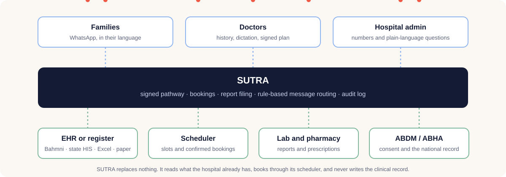

  

  <b>Health-a-thon 2026</b> · Cancer care · Patient follow-up and continuity of care · Round 1

---

## The problem

Cancer care runs for months: surgery, six cycles of chemotherapy with a blood test before each one, radiotherapy and follow-up. In most Indian hospitals, the record of that care is split across paper slips, phone calls and systems that do not talk to each other. Every instruction can be right and a step can still be missed, because nothing in the hospital holds the patient's plan and follows it through.

  

## What SUTRA does

SUTRA is an assistive follow-through layer. It sits on top of whatever the hospital already has, whether that is Bahmni, a state hospital system, an Excel register or a paper one, and it follows each patient's plan through.

- **The doctor signs one plan.** The oncologist sees the patient's history from every hospital on one screen, with a source on every line, then signs a six-month pathway with the timing of each test. No model can change it.
- **SUTRA books every step.** Caregivers book on the WhatsApp number the family already uses. A family is told a slot is booked only after the hospital's own scheduler confirms it.
- **Reports come back to the doctor.** The family sends a photo of the report, a records clerk confirms it is the right patient, and it is filed for the doctor to read.
- **Every question reaches a person.** A model only tags what a message is about. Rules written by the unit's clinicians decide whether it gets the plan's exact words, goes to a nurse, or reaches the doctor.
- **The hospital can see its own follow-through.** The admin sees how many planned steps happened on time and can ask questions in plain words. Nothing is ever scored or ranked.
- **ABHA along the way.** Records are linked to ABHA, the national health ID, whenever a patient has one or asks for one.

  

## Principles

| | |
|---|---|
| **Assistive, not diagnostic** | SUTRA never diagnoses, prescribes, scores risk or interprets a medical value. People decide everything clinical. |
| **Replaces nothing** | It reads the hospital's systems, books through its scheduler, and never writes the clinical record. |
| **Consent first** | Nothing leaves the hospital without a doctor's signature and the patient's consent. |
| **Open source** | SUTRA and its connectors are published under the AGPL licence, free for any hospital to run on its own servers. |

## Status and roadmap

- [x] Round 1 idea submission and design mockups
- [ ] Five-week build sprint: register import, WhatsApp booking, one signed pathway and one filed report
- [ ] Live prototype demo at the finale
- [ ] Ninety-day pilot in one oncology OPD, measured by one number: the share of planned next steps taken inside the window the doctor set

## Team

**Dhvani Bhide** (clinical lead) and **Charitra Arora**.

SUTRA means thread: one thread running through a patient's care, from the plan a doctor signs to the day the treatment happens.
